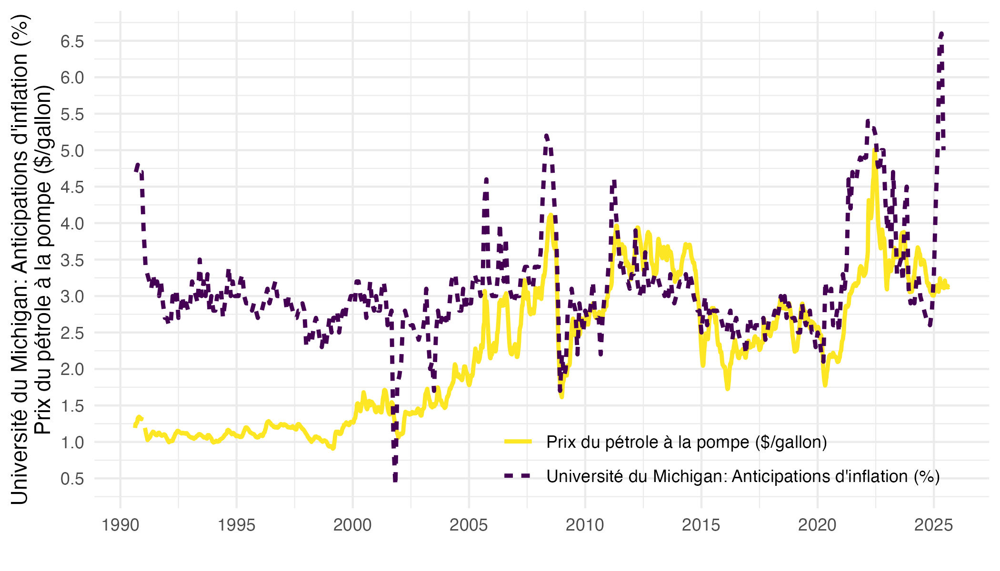

# Les politiques économiques de lutte contre l’inflation en Europe

Ce dépôt met à disposition des codes de réplication pour les graphiques du [chapitre](https://www.ofce.sciences-po.fr/pdf/ouvrage/2024-EE-04.pdf) dans l'Economie Européenne 2024 "Les politiques économiques de lutte contre l’inflation en Europe".

## Graphique 1: Contributions à l’inflation en zone euro

[Code R](graphique1.R)

## Graphique 2: Évolution des salaires réels en Europe (100 = janvier 2017)

[Code R](graphique2.R)

## Graphique 3: Part des profits dans la valeur ajoutée (% du PIB)

[Code R](graphique3.R)

## Graphique 4: Anticipations d’inflation et prix du pétrole aux États-Unis

[Code R](graphique4.R)

