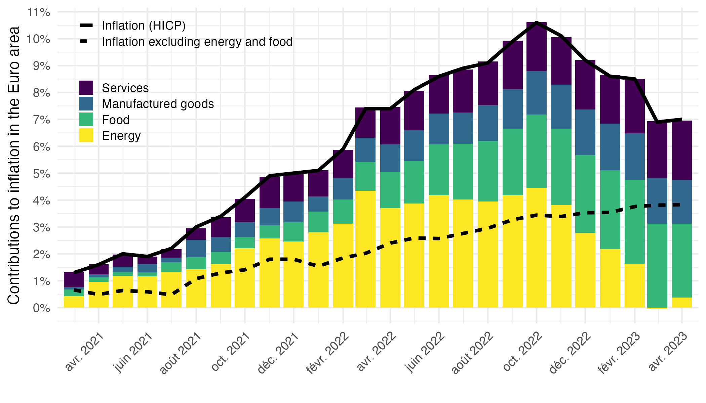
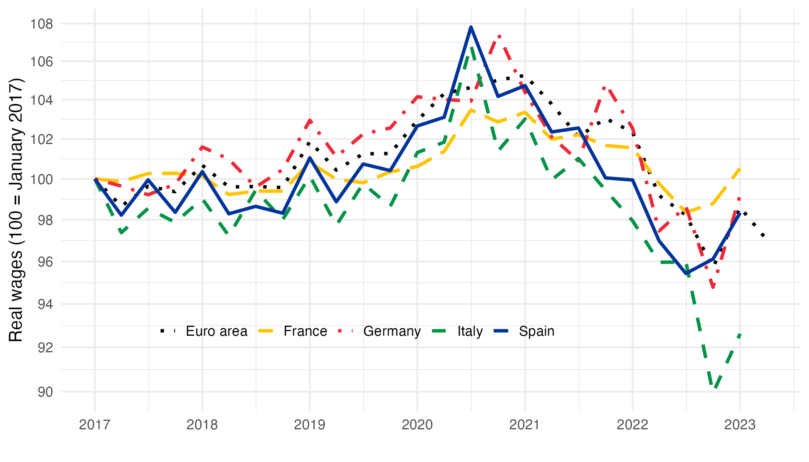
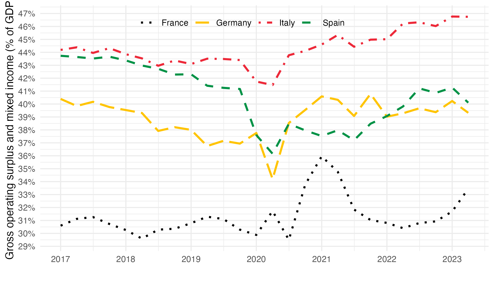
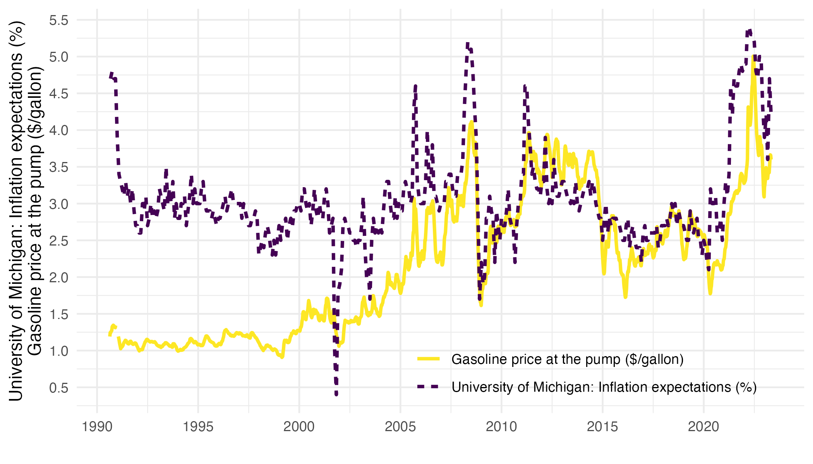

# Economic Policies to Fight Inflation in Europe

This repository provides replication codes for the figures of the [chapter](https://fgeerolf.com/EE2024-inflation.pdf) in *European Economy 2024*:  
**"Economic Policies to Fight Inflation in Europe"**.

## Figure 1: Contributions to inflation in the euro area

[R Code](figure1.R)

## Figure 2: Evolution of real wages in Europe (100 = January 2017)

[R Code](figure2.R)

## Figure 3: Share of profits in value added (% of GDP)

[R Code](figure3.R)

## Figure 4: Inflation expectations and oil prices in the United States

[R Code](figure4.R)

